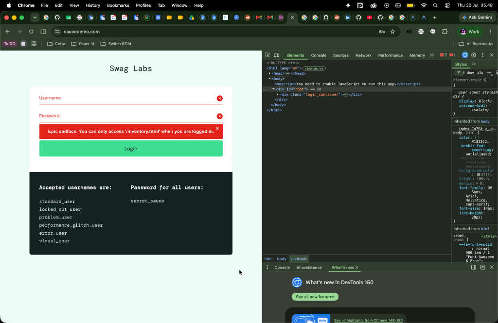
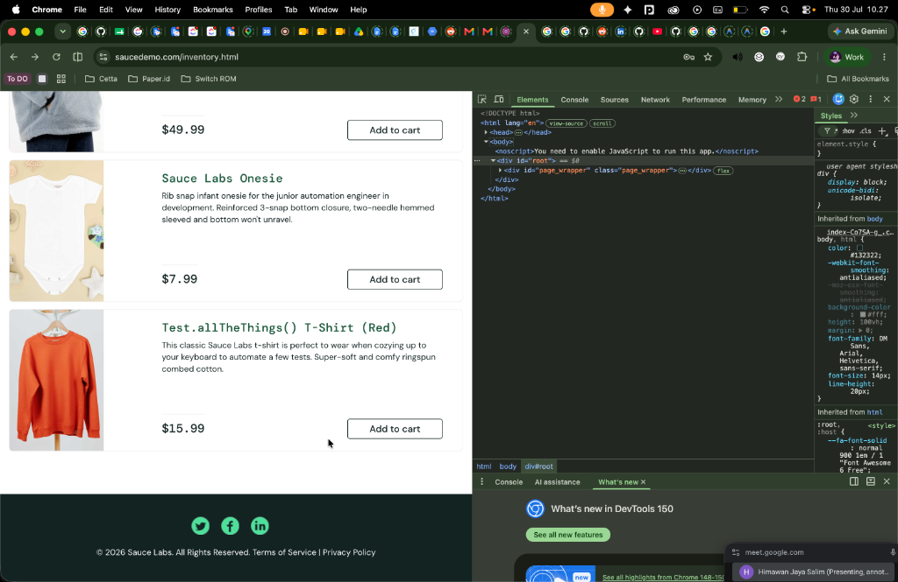
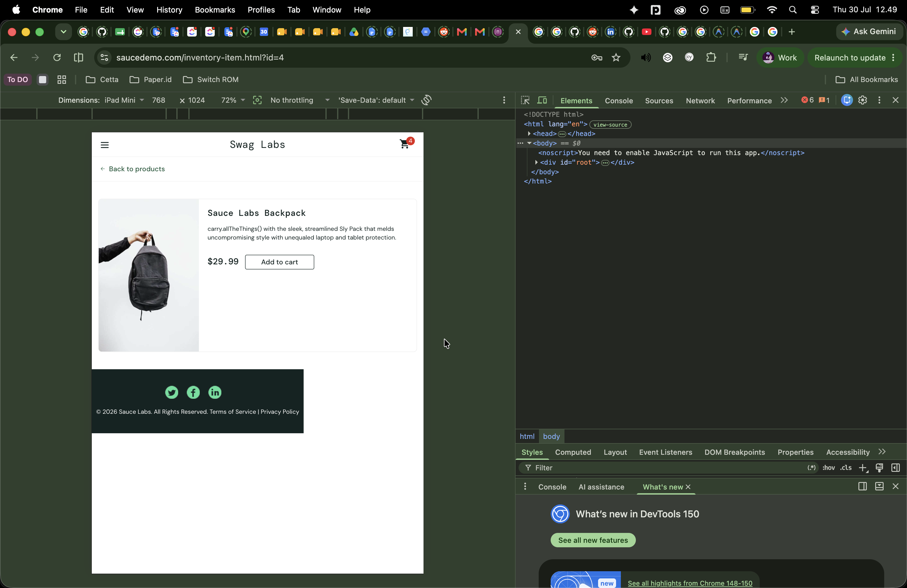
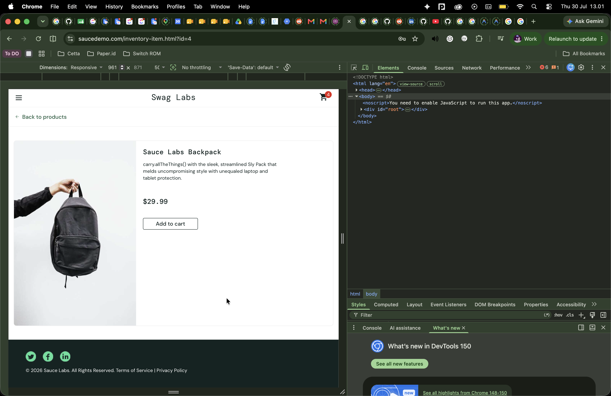
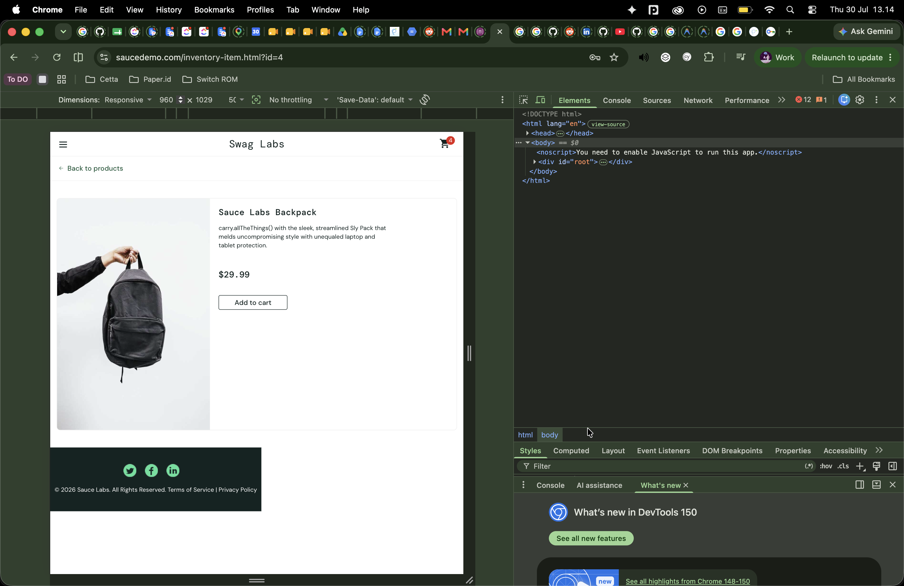

# Exploratory Testing & Bug Report
## Senior QA Engineer Take-Home Assessment — KliknClean

Exploratory testing conducted on **SauceDemo** (`https://www.saucedemo.com`).

---

### Bug Report 1: [Session] - Session ended kicks user immediately to login when clicking back to home

- **Bug ID**: `BUG-001`
- **Severity**: Medium
- **Type**: UX / Session Management
- **Environment**: Desktop Chrome

#### Summary
When a user remains idle on the checkout success page until their session expires, clicking the "Back Home" button abruptly kicks them back to the login page. Instead of a clear session expiration notice, they receive a generic "Epic sadface: You can only access '/inventory.html' when you are logged in." error.

#### Steps to Reproduce
1. Login with a standard account (`standard_user`).
2. Add a product to the cart.
3. Open the cart and proceed to checkout.
4. Fill out Checkout Step 1 and proceed.
5. Review the order on Step 2 (Overview) and click "Finish".
6. Wait on the Checkout Complete page for ~5 minutes until the session expires.
7. Click the "Back Home" button.

#### Expected Result
The system should gracefully inform the user that their session has expired (e.g., via a "Session Ended" popup or a dedicated session expiration page) before redirecting them to the login screen.

#### Actual Result
The user is immediately kicked to the login page and presented with a generic access error: "Epic sadface: You can only access '/inventory.html' when you are logged in."

#### Recommendation
Implement a proactive session validation check before routing. When a session expiry is detected, present the user with a clear, user-friendly message explaining that they have been logged out due to inactivity, rather than displaying an access violation error.

---

### Bug Report 2: [Data] - Product name contains testing artifact string

- **Bug ID**: `BUG-002`
- **Severity**: Low
- **Type**: Data Quality / UI
- **Environment**: Desktop Chrome

#### Summary
A product is displayed in the catalog with a name that looks like internal testing code: "Test.allTheThings() T-Shirt (Red)". This appears to be test data or a placeholder name that leaked into the production environment, reducing the professionalism of the store interface.

#### Steps to Reproduce
1. Login with a valid account (e.g. `standard_user`).
2. View the products on the inventory page.
3. Scroll down and locate the red t-shirt product.

#### Expected Result
All products in the catalog should display proper, customer-facing names without code snippets or testing placeholders.

#### Actual Result
The product name is displayed as `Test.allTheThings() T-Shirt (Red)`.

#### Recommendation
Update the database entry for this product to use a proper commercial name (e.g., "Sauce Labs T-Shirt (Red)") and ensure a data validation or staging approval process is in place to prevent mock data from reaching the production storefront.

---

### Bug Report 3: [UI/Responsive] - Footer is not responsive on iPad Mini resolution

- **Bug ID**: `BUG-003`
- **Severity**: Medium
- **Type**: UI / Responsiveness
- **Environment**: iPad Mini (Resolution 768x1024) via Browser DevTools

#### Summary
When viewing the application on a tablet resolution—specifically the iPad Mini (768x1024)—the footer fails to respond dynamically to the screen size. Instead of spanning the full width of the screen, the footer is constrained to the left side, leaving a massive empty white gap on the right.

*Further Testing Note:* The footer remains fully responsive at a width of 961px (e.g., 961x1029), but exactly at 960px width and below, it breaks and becomes completely unresponsive.

#### Steps to Reproduce
1. Open the SauceDemo website in a web browser (e.g., Chrome).
2. Login with a valid account (e.g. `standard_user`).
3. Open the browser's Developer Tools and toggle the Device Toolbar (Responsive View).
4. Change the view device to **iPad Mini** (or manually set the resolution to 768 x 1024).
5. Scroll down to the very bottom of the page.
6. Observe the layout and width of the dark footer block.

#### Expected Result
The footer container should be fully responsive and dynamically span 100% of the viewport width across all device resolutions, matching the layout structure of the rest of the application.

#### Actual Result
The footer is constrained to a fixed maximum width and does not adapt to the 768px screen width of the iPad Mini, leaving a large blank space on the right side.

#### Recommendation
Update the CSS styling for the footer container (e.g., `.footer`). Ensure it is set to `width: 100%;` and that any restrictive `max-width` properties are overridden or properly handled in the CSS media queries for tablet breakpoints (e.g., `@media (min-width: 768px)`).
